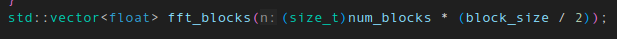

# Übungsblatt 2 - Ergebnisbericht

## Kapitel 1: Implementierung
### Aufgabe 1
In anbetracht der folgenden Aufgaben, habe ich mich diesmal bei der Implementierung für C++ entschieden, da die OpenCL-API, die später zum Einsatz kommt, in erster Linie für C und C++ entwickelt wurde. So kann ich für jede Aufgabe die gleiche Programmiersprache verwenden, und behalte dabei die optimale Vergleichbarkeit bei. Ich habe mir also eine einfache Implementierung des Cooley-Tukey FFT-Algorithmus mithilfe von ChatGPT 4o generieren lassen, die den Anforderungen der Aufgabe entspricht. Das Programm läuft ohne Parallelisierung.

Die Inputs werden dem Programm als Parameter übergeben: ./fourier_base <file_name> <block_size> <step_width> <amplitude_threshold>

Für das Einlesen der WAV-Datei wurde die Bibliothek sndfile verwendet. Außerdem habe ich eine Laufzeitmessung eingebaut, wofür ich die Bibliothek "chrono" verwendet habe.

### Aufgabe 2
Für die Generierung der WAV-Files reichte auch eine simple Anfrage an GPT 4o aus. So habe ich ein C++ Programm generiert, das die Aufgabe erfüllt: Es liest die nötigen Parameter mithilfe von Fragen über die Konsole ein: 

1. Die Gesamtdauer der WAV-Datei
2. Die Anzahl der einzubauenden Frequenzen
3. Für jede Frequenz je Frequenz in Hertz und Amplitude (Hier sollte ein Wert zwischen 0 und 1 angegeben werden, um ein Übersteuern zu verhindern)
4. Einen Dateinamen, unter dem die Datei gespeichert werden soll.

Ich habe mir ein paar Beispiel-Dateien generiert (Stille, einzelne Frequenzen, mehrere Frequenzen überlagert), um die Funktion des Programms zu testen. Nachdem ich mich zunächst durch Abspielen der WAV-Files von der Integrität der Dateien überzeugte, habe ich meine Lösung aus Aufgabe 1 verwendet, um die korrekt eingebetteten Frequenzen herauszufiltern. Dies gelang in allen Szenarien. Folgende Dateien wurden dafür generiert:

1. `silence-100s.wav` enthält 100 Sekunden Stille.
2. `420hz-100s.wav` enthält 100 Sekunden eine Frequenz von 420hz (Amplitude 0.8)
3. `octave-100s.wav` enthält 100 Sekunden die Frequenzen 420hz und 840hz (Amplitude je 0.4)
4. `random-100s.wav` enthält drei zufällige Frequenzen 42hz (0.3), 1337hz (0.2) und 6900hz (0.2)

### Aufgabe 3
Auch hier reichte eine kurze Unterhaltung mit ChatGPT 4o, damit das Sprachmodell eine brauchbare Lösung ausspuckte. So wandelte es den C++ Code in eine mithilfe von Multi-Threading parallelisierte Version um, die alle verfügbaren Kerne des Systems auslasten. Ich testete das Programm zunächst mithilfe der `nicht_zu_laut_abspielen.wav` aus der ersten Übung auf korrekte Funktion und stellte bereits hier einen erheblichen Speed-Up fest. Weitere Tests sollten im nächsten Kapitel dann folgen, nachdem alle Implementierungen bereit waren.

Die Verwendung des Programms sowie die Ergebnisse unterscheiden sich nicht von dem Programm aus Aufgabe 1. Als zusätzliche C++ Bibliotheken wurden `thread` und `mutex` verwendet.

### Aufgabe 4
Diese Aufgabe sollte sich als erstaunlich schwierig herausstellen. Zunächst bat ich GPT 4o, mir, analog zu Aufgabe 3, eine Abwandlung der bestehenden Implementierung zu generieren, die aber statt der `threads`-Bibliothek OpenCL zur Parallelisierung verwenden sollte. Das klappte leider nicht sehr gut. Das Ergebnis war ein recht komplexer OpenCL-Kernel, dessen Funktion ich nicht gut nachvollziehen konnte. Problematisch an der Stelle war, dass in OpenCL offenbar Rekursion nicht funktioniert. Jedenfalls versuchte GPT, den eigentlich Rekursiven Cooley-Tukey-Algorithmus in eine Iterative Variante umzuwandelt, was ihm wohl nicht gelang. Dies führte zu erstaunlichem Verhalten: Je nach übergebenen Parametern für Block-Größe und Versatz veränderte sich die Größenordnung der errechneten Amplituden um mehrere Zehnerpotenzen. Zudem verhielt sich das Programm nicht mehr deterministisch: Bei zwei aufeinander folgenden Läufen mit gleichen Parametern entstand ein leicht unterschiedlicher Output.

Ich verbrachte viele Stunden damit zu versuchen, das Problem zu finden und zu lösen, doch konnte es nicht schaffen. Der Code war zu komplex und ich weder vertraut mit dem Cooley-Tukey-Algorithmus, noch mit OpenCL.

Ich versuchte dann, den Kernel durch einen deutlich vereinfachten Kernel auszutauschen, der stattdessen die Diskrete Fourier-Transformation durchführt, die deutlich einfacher iterativ zu implementieren ist. Doch irgendwie konnte ich es nicht schaffen, den Output des Kernels richtig zu empfangen: Ich erhielt stets einen Nullvektor als Return-Wert.

Letztendlich gelang mir der Durchbruch, indem ich GPT bat, mir ein neues C++ Programm um den vereinfachten Kernel herum zu bauen. Dies gelang schließlich, und ich erhielt endlich plausible, deterministische Ergebnisse, wenn auch die Größenordnung der Amplituden sich von denen aus den Aufgaben 1 und 3 unterschied. Die Größenordnung bleibt jetzt jedoch bei verschiedenen Parametern für Block-Größe und Versatz gleich.

Auch wenn die Laufzeit der DFT mit O(n²) größer ist als die der FFT mit O(n log n), sollte aufgrund der hohen Parallelisierung ein Speedup bei einer großen Block-Anzahl zu erwarten sein.

## Kapitel 2: Experimente
### Erkennen der Frequenzen in den zuvor generierten Testfiles

Zunächst wollte ich noch einmal die Programme im Hinblick auf ihre Funktionstüchtigkeit testen: Erkennen alle Implementierungen die eingebetteten Frequenzen ordnungsgemäß? dafür wähle ich für Blockgröße und Versatz je die größtmöglichen Werte 512/512, um die Berechnungen möglichst schnell zu verarbeiten.

#### Test 1: silence
Bei einer "leeren" Datei sollten alle Amplituden null sein und dies müssten die Programme auch akkurat wiedergeben können. Also wählte ich für den Threshold immer 0. Wie erwartet wurden bei allen Programmen keine gefundenen Frequenzen ausgegeben.

#### Test 2: 420hz
Eine einzelne Frequenz zu erkennen, sollte kein Problem für die Programme darstellen. Hier musste ich zunächst ein bisschen mit den Threshold-Werten herumprobieren, um die herausstechende Frequenz herauszufiltern, dann zeigte sich das erwartete Ergebnis: Ein starker Ausschlag bei 430.7hz, was die nächstgelegene Frequenz zu 420hz ist, die bei einer Blockgröße von 512 abgedeckt wird.

#### Test 3: Oktavensprung über 420hz
Ich habe mich gefragt, ob eine Oktavierung des Tons auf 840hz vielleicht besondere Phänomene hervorruft. Doch nichts besonderes fiel auf, die Programme waren wieder dazu in der Lage, unter Angabe eines geeigneten Thresholds die beiden Frequenzen akkurat herauszustellen:

#### Test 4: Zufällig gewählte Frequenzen
Der vollständigkeit halber: Auch hier waren alle Programme erfolgreich. Aufgrund der niedrigeren individuellen Amplituden in diesem Sample musste ich allerdings die Threshold-Werte etwas reduzieren:

### Laufzeitanalyse und Vergleiche
Ich habe die Laufzeit auf zwei verschiedenen Systemen getestet, hier folgen die Konfigurationen:

#### Testsystem 1
<table>
    <tr>
        <th>Parameter</th>
        <th>Wert</th>
    </tr>
    <tr>
        <td>Betriebssystem</td>
        <td>Arch Linux</td>
    </tr>
    <tr>
        <td>Kernel Version</td>
        <td>Linux 6.9.9-arch1-1</td>
    </tr>
    <tr>
        <td>CPU Modell</td>
        <td>Intel Core i5-2500K</td>
    </tr>
    <tr>
        <td>CPU Taktfrequenz</td>
        <td>3.70 GHz</td>
    </tr>
    <tr>
        <td>CPU Kernanzahl</td>
        <td>4 (4)</td>
    </tr>
    <tr>
        <td>CPU HyperThreading Support</td>
        <td>Nein</td>
    </tr>
    <tr>
        <td>GPU Modell</td>
        <td>NVIDIA GeForce GTX 1650</td>
    </tr>
    <tr>
        <td>Anzahl GPU-Cores</td>
        <td>896</td>
    </tr>
    <tr>
        <td>GPU Clock</td>
        <td>2160 MHz</td>
    </tr>
    <tr>
        <td>GPU VRAM</td>
        <td>4 GB</td>
    </tr>
</table>

Für die Laufzeitanalyse habe ich mich entschieden, die Datei `octave_100s.wav` aus den vorhergehenden Experimenten zu verwenden, da diese besonders klare Ergebnisse lieferte. Um die gewünschte Laufzeit von 5 - 10 Minuten zu erzielen, habe ich jedoch die Länge der Datei verdreifacht auf 300 sekunden. Die resultierende Datei ist `octave_300s.wav`. Zunächst experimentierte ich mit der sequenziellen Lösung herum, bis ich Parameter fand, die in dem gewünschten Laufzeitbereich zwischen 5 und 10 Minuten lagen. Mit den Parametern Block-Size = 512 und Step-Width = 2 kam ich mit der Sequentiellen Lösung so auf eine passende Laufzeit. 

Leider kam es bei der Berechnung der Größe des Ausgabevektors zu einem buffer-overflow Fehler, der zu einem Programmabsturz führte. Diesen konnte ich mit einem Cast und einer Klammerung der Rechnung beheben:

 Auf der GTX 1650 reicht jedoch augenscheinlich der VRAM nicht aus, um die Fourier-Analyse mit den gegebenen Parametern durchzuführen, denn das Programm lieferte mit diesen Parametern keine Ergebnisse. Daher habe ich noch weitere Analysen mit anderen Parametern durchgeführt:

#### Laufzeiten Testsystem 1
<table>
    <tr>
        <th>Programm</th>
        <th>Laufzeit 512/2</th>
        <th>Rel. Speedup</th>
        <th>Laufzeit 512/4</th>
        <th>Rel. Speedup</th>
    </tr>
    <tr>
        <td>Base</td>
        <td>538 s</td>
        <td>1</td>
        <td>274 s</td>
        <td>1</td>
    </tr>
    <tr>
        <td>Threads</td>
        <td>157 s</td>
        <td>3,43 (k = 4)</td>
        <td>77 s</td>
        <td>3,56 (k = 4)</td>
    </tr>
    <tr>
        <td>OpenCL</td>
        <td>Kein Ergebnis</td>
        <td>Kein Ergebnis</td>
        <td>347 s</td>
        <td>0,79</td>
    </tr>
</table>
<table>
    <tr>
        <th>Programm</th>
        <th>Laufzeit 512/8</th>
        <th>Rel. Speedup</th>
    </tr>
    <tr>
        <td>Base</td>
        <td>135 s</td>
        <td>1</td>
    </tr>
    <tr>
        <td>Threads</td>
        <td>38 s</td>
        <td>3,55 (k = 4)</td>
    </tr>
    <tr>
        <td>OpenCL</td>
        <td>6,5 s</td>
        <td>20,77</td>
    </tr>
</table>

Es lässt sich erkennen, dass, während die über CPU parallelisierte Variante einen konstanten Speedup von etwa 3,5 erzielt, die OpenCL-Lösung auf diesem Rechner bei zu großen Datenmengen schnell an ihre Grenzen kommt. Durch die Beobachtung der VRAM-Auslastung gehe ich davon aus, dass dies an dem nur 4 GB großen Videospeicher der 1650 liegt. Um diese Theorie zu bestätigen, führe ich die Laufzeittests noch auf einem zweiten Testsystem durch.

#### Testsystem 2
<table>
    <tr>
        <th>Parameter</th>
        <th>Wert</th>
    </tr>
    <tr>
        <td>Betriebssystem</td>
        <td>Linux Mint 21.3</td>
    </tr>
    <tr>
        <td>Kernel Version</td>
        <td>Linux 6.5.0-41-generic</td>
    </tr>
    <tr>
        <td>CPU Modell</td>
        <td>Intel Core i5-10400F</td>
    </tr>
    <tr>
        <td>CPU Taktfrequenz</td>
        <td>4.30 GHz</td>
    </tr>
    <tr>
        <td>CPU Kernanzahl</td>
        <td>6 (12)</td>
    </tr>
    <tr>
        <td>CPU HyperThreading Support</td>
        <td>Ja</td>
    </tr>
    <tr>
        <td>GPU Modell</td>
        <td>Intel Arc A770</td>
    </tr>
    <tr>
        <td>Anzahl GPU-Cores</td>
        <td>4096</td>
    </tr>
    <tr>
        <td>GPU Clock</td>
        <td>2400 MHz</td>
    </tr>
    <tr>
        <td>GPU VRAM</td>
        <td>16 GB</td>
    </tr>
</table>

#### Laufzeiten Testsystem 2
<table>
    <tr>
        <th>Programm</th>
        <th>Laufzeit 512/2</th>
        <th>Rel. Speedup</th>
        <th>Laufzeit 512/4</th>
        <th>Rel. Speedup</th>
    </tr>
    <tr>
        <td>Base</td>
        <td>367 s</td>
        <td>1</td>
        <td>190 s</td>
        <td>1</td>
    </tr>
    <tr>
        <td>Threads</td>
        <td>56,8 s</td>
        <td>6,46 (k = 6)</td>
        <td>28,5 s</td>
        <td>6,67 (k = 6)</td>
    </tr>
    <tr>
        <td>OpenCL</td>
        <td>Kein Ergebnis</td>
        <td>Kein Ergebnis</td>
        <td>Kein Ergebnis</td>
        <td>Kein Ergebnis</td>
    </tr>
</table>
<table>
    <tr>
        <th>Programm</th>
        <th>Laufzeit 512/8</th>
        <th>Rel. Speedup</th>
    </tr>
    <tr>
        <td>Base</td>
        <td>92 s</td>
        <td>1</td>
    </tr>
    <tr>
        <td>Threads</td>
        <td>14,3 s</td>
        <td>6,43 (k = 6)</td>
    </tr>
    <tr>
        <td>OpenCL</td>
        <td>2,29 s</td>
        <td>40,17</td>
    </tr>
</table>

Auch auf diesem System trat das Problem auf, dass die Laufzeit bei 512/4 ins Unermessliche stieg. Woran das genau liegt, kann ich aktuell nicht sagen, nur dass ein CPU-Kern zu 100% ausgelastet wird, während die GPU sich nach einem kurzen Startsprint langweilt. Jedenfalls funktioniert das Programm mit den Parametern 256/1 einwandfrei, obwohl die Gesamtdatenmenge dabei größer ist als bei 512/4. Um das Potenzial der OpenCL-Lösung zu zeigen, habe ich daher auf Testsystem 2 noch die Konfiguration 256/1 getestet.

<table>
    <tr>
        <th>Programm</th>
        <th>Laufzeit 256/1</th>
        <th>Rel. Speedup</th>
    </tr>
    <tr>
        <td>Base</td>
        <td>332 s</td>
        <td>1</td>
    </tr>
    <tr>
        <td>Threads</td>
        <td>53,0 s</td>
        <td>6,26 (k = 6)</td>
    </tr>
    <tr>
        <td>OpenCL</td>
        <td>5,98 s</td>
        <td>55,52</td>
    </tr>
</table>

Diese letzte Reihe würde ich als die beste und aussagekräftigste bezeichnen. Hier sieht man sehr deutlich, dass OpenCL einen beträchtlichen Speed-Up bringen kann, wenn es korrekt eingesetzt wird. Dass der Speed-Up hier nicht 4096 beträgt, sollte klar sein, da die Shader-Einheiten der Grafikkarte bei weitem nicht so leistungsstark sind, wie ein CPU-Kern. Außerdem ist noch mit einem gewissen Overhead durch das Verwalten der vielen Threads zu rechnen.

Auch zeigt das zweite Testsystem, dass Hyperthreading durchaus einen Vorteil bei hoch parallelisierten Anwendungen bringen kann: Bei Testsystem 2 wurde bei der Threading-Variante das Speed-Up-Ziel von 6 sogar übertroffen! Warum genau die OpenCL-Version bei den Konfigurationen 512/4 und 512/2 so kläglich scheiterte, kann ich mir auf Anhieb nicht erklären und die Antwort darauf ist wohl im Code zu suchen.

Dennoch hat diese Versuchsreihe viele gute Erkenntnisse produziert, und ich bin mit dem Gesamtergebnis zufrieden.