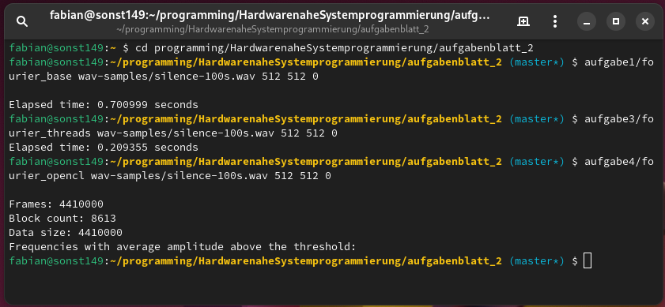
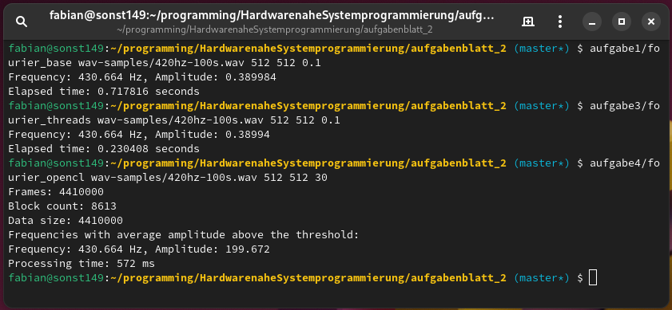
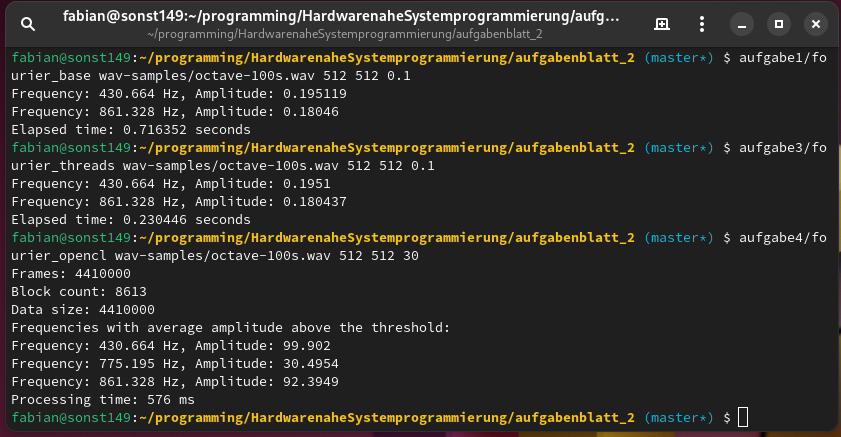
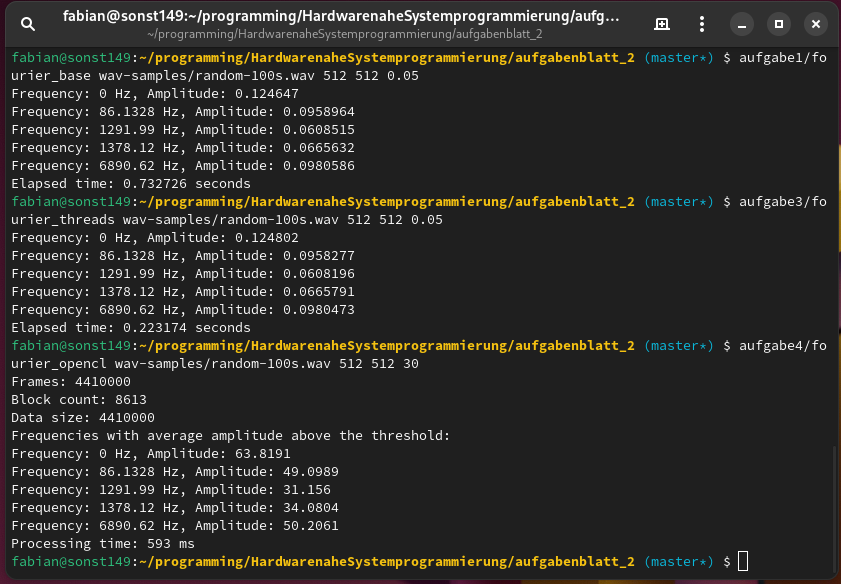

# Übungsblatt 2 - Ergebnisbericht

## Kapitel 1: Implementierung
### Aufgabe 1
In anbetracht der folgenden Aufgaben, habe ich mich diesmal bei der Implementierung für C++ entschieden, da die OpenCL-API, die später zum Einsatz kommt, in erster Linie für C und C++ entwickelt wurde. So kann ich für jede Aufgabe die gleiche Programmiersprache verwenden, und behalte dabei die optimale Vergleichbarkeit bei. Ich habe mir also eine einfache Implementierung des Cooley-Tukey FFT-Algorithmus mithilfe von ChatGPT 4o generieren lassen, die den Anforderungen der Aufgabe entspricht. Das Programm läuft ohne Parallelisierung.

Die Inputs werden dem Programm als Parameter übergeben: ./fourier_base <file_name> <block_size> <step_width> <amplitude_threshold>

Für das Einlesen der WAV-Datei wurde die Bibliothek sndfile verwendet. Außerdem habe ich eine Laufzeitmessung eingebaut, wofür ich die Bibliothek "chrono" verwendet habe.

### Aufgabe 2
Für die Generierung der WAV-Files reichte auch eine simple Anfrage an GPT 4o aus. So habe ich ein C++ Programm generiert, das die Aufgabe erfüllt: Es liest die nötigen Parameter mithilfe von Fragen über die Konsole ein: 

1. Die Gesamtdauer der WAV-Datei
2. Die Anzahl der einzubauenden Frequenzen
3. Für jede Frequenz je Frequenz in Hertz und Amplitude (Hier sollte ein Wert zwischen 0 und 1 angegeben werden, um ein Übersteuern zu verhindern)
4. Einen Dateinamen, unter dem die Datei gespeichert werden soll.

Ich habe mir ein paar Beispiel-Dateien generiert (Stille, einzelne Frequenzen, mehrere Frequenzen überlagert), um die Funktion des Programms zu testen. Nachdem ich mich zunächst durch Abspielen der WAV-Files von der Integrität der Dateien überzeugte, habe ich meine Lösung aus Aufgabe 1 verwendet, um die korrekt eingebetteten Frequenzen herauszufiltern. Dies gelang in allen Szenarien. Folgende Dateien wurden dafür generiert:

1. `silence-100s.wav` enthält 100 Sekunden Stille.
2. `420hz-100s.wav` enthält 100 Sekunden eine Frequenz von 420hz (Amplitude 0.8)
3. `octave-100s.wav` enthält 100 Sekunden die Frequenzen 420hz und 840hz (Amplitude je 0.4)
4. `random-100s.wav` enthält drei zufällige Frequenzen 42hz (0.3), 1337hz (0.2) und 6900hz (0.2)

### Aufgabe 3
Auch hier reichte eine kurze Unterhaltung mit ChatGPT 4o, damit das Sprachmodell eine brauchbare Lösung ausspuckte. So wandelte es den C++ Code in eine mithilfe von Multi-Threading parallelisierte Version um, die alle verfügbaren Kerne des Systems auslasten. Ich testete das Programm zunächst mithilfe der `nicht_zu_laut_abspielen.wav` aus der ersten Übung auf korrekte Funktion und stellte bereits hier einen erheblichen Speed-Up fest. Weitere Tests sollten im nächsten Kapitel dann folgen, nachdem alle Implementierungen bereit waren.

Die Verwendung des Programms sowie die Ergebnisse unterscheiden sich nicht von dem Programm aus Aufgabe 1. Als zusätzliche C++ Bibliotheken wurden `thread` und `mutex` verwendet.

### Aufgabe 4
Diese Aufgabe sollte sich als erstaunlich schwierig herausstellen. Zunächst bat ich GPT 4o, mir, analog zu Aufgabe 3, eine Abwandlung der bestehenden Implementierung zu generieren, die aber statt der `threads`-Bibliothek OpenCL zur Parallelisierung verwenden sollte. Das klappte leider nicht sehr gut. Das Ergebnis war ein recht komplexer OpenCL-Kernel, dessen Funktion ich nicht gut nachvollziehen konnte. Problematisch an der Stelle war, dass in OpenCL offenbar Rekursion funktioniert. Jedenfalls versuchte GPT, den eigentlich Rekursiven Cooley-Tukey-Algorithmus in eine Iterative Variante umzuwandelt, was ihm wohl nicht gelang. Dies führte zu erstaunlichem Verhalten: Je nach übergebenen Parametern für Block-Größe und Versatz veränderte sich die Größenordnung der errechneten Amplituden um mehrere Zehnerpotenzen. Zudem verhielt sich das Programm nicht mehr deterministisch: Bei zwei aufeinander folgenden Läufen mit gleichen Parametern entstand ein leicht unterschiedlicher Output.

Ich verbrachte viele Stunden damit zu versuchen, das Problem zu finden und zu lösen, doch konnte es nicht schaffen. Der Code war zu komplex und ich weder vertraut mit dem Cooley-Tukey-Algorithmus, noch mit OpenCL.

Ich versuchte dann, den Kernel durch einen deutlich vereinfachten Kernel auszutauschen, der stattdessen die Diskrete Fourier-Transformation durchführt, die deutlich einfacher iterativ zu implementieren ist. Doch irgendwie konnte ich es nicht schaffen, den Output des Kernels richtig zu empfangen: Ich erhielt stets einen Nullvektor als Return-Wert.

Letztendlich gelang mir der Durchbruch, indem ich GPT bat, mir ein neues C++ Programm um den vereinfachten Kernel herum zu bauen. Dies gelang schließlich, und ich erhielt endlich plausible, deterministische Ergebnisse, wenn auch die Größenordnung der Amplituden sich von denen aus den Aufgaben 1 und 3 unterschied. Die Größenordnung bleibt jetzt jedoch bei verschiedenen Parametern für Block-Größe und Versatz gleich.

Auch wenn die Laufzeit der DFT mit O(n²) größer ist als die der FFT mit O(n log n), sollte aufgrund der hohen Parallelisierung ein Speedup bei einer großen Block-Anzahl zu erwarten sein.

## Kapitel 2: Experimente
### Erkennen der Frequenzen in den zuvor generierten Testfiles

Zunächst wollte ich noch einmal die Programme im Hinblick auf ihre Funktionstüchtigkeit testen: Erkennen alle Implementierungen die eingebetteten Frequenzen ordnungsgemäß? dafür wähle ich für Blockgröße und Versatz je die größtmöglichen Werte 512/512, um die Berechnungen möglichst schnell zu verarbeiten.

#### Test 1: silence
Bei einer "leeren" Datei sollten alle Amplituden null sein und dies müssten die Programme auch akkurat wiedergeben können. Also wählte ich für den Threshold immer 0. Wie erwartet wurden bei allen Programmen keine gefundenen Frequenzen ausgegeben.

#### Test 2: 420hz
Eine einzelne Frequenz zu erkennen, sollte kein Problem für die Programme darstellen. Hier musste ich zunächst ein bisschen mit den Threshold-Werten herumprobieren, um die herausstechende Frequenz herauszufiltern, dann zeigte sich das erwartete Ergebnis: Ein starker Ausschlag bei 430.7hz, was die nächstgelegene Frequenz zu 420hz ist, die bei einer Blockgröße von 512 abgedeckt wird.

#### Test 3: Oktavensprung über 420hz
Ich habe mich gefragt, ob eine Oktavierung des Tons auf 840hz vielleicht besondere Phänomene hervorruft. Doch nichts besonderes fiel auf, die Programme waren wieder dazu in der Lage, unter Angabe eines geeigneten Thresholds die beiden Frequenzen akkurat herauszustellen:

#### Test 4: Zufällig gewählte Frequenzen
Der vollständigkeit halber: Auch hier waren alle Programme erfolgreich. Aufgrund der niedrigeren individuellen Amplituden in diesem Sample musste ich allerdings die Threshold-Werte etwas reduzieren:

